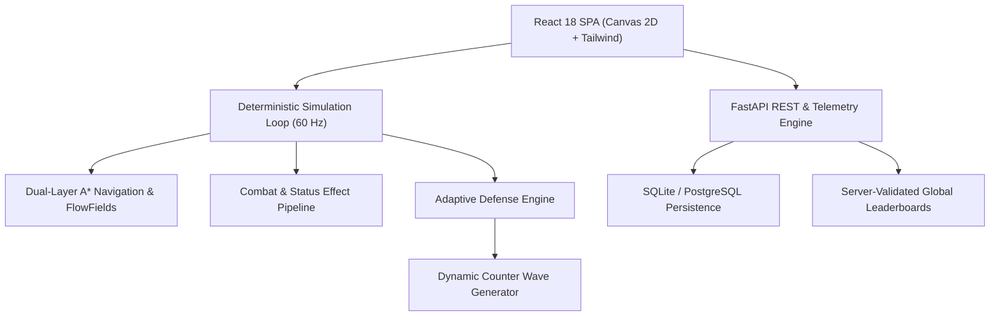

# Sentinel Grid — System Architecture & Engineering Blueprint

## Overview
Sentinel Grid is a production-grade 2D strategy and tower-defense game engineered with a deterministic fixed-timestep simulation kernel, data-driven entity components, dual-layer navigation graph with A* pathfinding, signature Adaptive Defense Engine, and modern full-stack web client/backend.

## Core Subsystems
1. **Simulation Kernel**: Deterministic 60Hz tick loop, PCG-XSH-RR seedable PRNG, Vector2D algebra, Spatial Hash Grid.
2. **Dual-Layer Navigation**: 8-directional ground navigation with A*, dynamic obstacle invalidation, flow-field swarm vectors, flying layer bypass.
3. **Data-Driven Towers & Targeting**: 20 specialized towers, 7 targeting strategies (First, Last, Closest, Strongest, Weakest, Threat, Custom), attack pipeline, status effect stacking.
4. **Enemy AI & Boss Phase Engine**: 20 enemy classes, behavior trees, sensory perception, multi-phase boss controllers with dynamic enrage mechanics.
5. **Adaptive Defense Engine**: Real-time player tactic profiling, vulnerability heatmaps, bounded difficulty controllers, and dynamic counter-wave generator.
6. **Economy & Active Abilities**: 3-tier economy (Credits, Energy, Strategic Tokens), 8 commander abilities, 3-branch upgrade graphs.
7. **Campaign & Level Editor**: 6 worlds, 30 missions, 10 challenge modes, visual level and wave editor.
8. **Deterministic Replay & Save**: Command stream recorder, bit-exact deterministic playback, checksum-verified save migrations.
9. **FastAPI Backend**: JWT authentication, server-side simulation verification, leaderboards, replay storage, analytics ingestion, admin controls.
